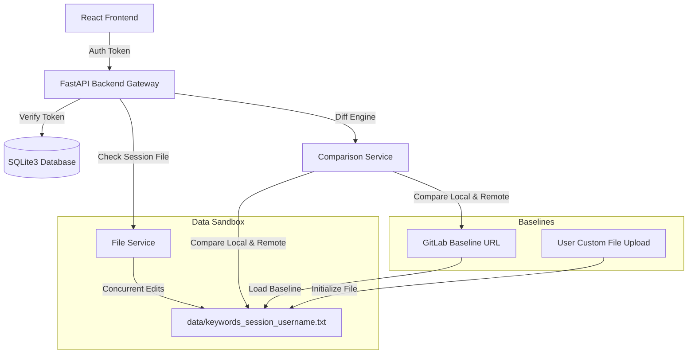

# Screening Automator - Documentation & Architecture Manual

Screening Automator is a full-stack dashboard utility engineered to parse, explore, update, and analyze feed-to-keyword list mappings. It helps compliance and operations teams manage keyword baselines locally in a sandboxed session and compare updates line-by-side with a remote GitLab server.

---

## 🏛️ Project Architecture & Data Flow

The application isolates user operations through a **sandboxed multi-user workflow** backed by an SQLite3 database.



### 1. Database Schema (`backend/data/users.db`)
The database uses SQLite3 to track registered users and active session tokens:
* **`users` Table**:
  * `id`: Integer (Primary Key, Autoincrement)
  * `username`: Text (Unique, Index)
  * `password_hash`: Text (PBKDF2 SHA256 hashed password + random salt)
* **`sessions` Table**:
  * `token`: Text (Primary Key, UUID session token)
  * `username`: Text (Foreign Key reference)
  * `created_at`: DateTime (Timestamp)

> [!NOTE]
> **Master User Seed**: On server initialization, if the `users` table is empty, a master user is automatically seeded:
> * **Username**: `master_user`
> * **Password**: `password123`

### 2. Multi-User Sandboxing
To support concurrent workspace editing:
1. When a user logs in, they select their baseline configuration (GitLab Master baseline or Custom File Upload).
2. The server initializes a workspace copy saved as `backend/data/keywords_session_{username}.txt`.
3. All subsequent queries, modifications, and comparisons operate **exclusively** on this sandboxed text file.
4. When logging out, the session token is revoked in the database, and their sandbox text file is deleted from the server to free up space.

---

## 📁 File Structure Map

```
Screening_automator/
├── backend/
│   ├── app/
│   │   ├── models/
│   │   │   └── schemas.py          # Pydantic schema structures for API validation
│   │   ├── routes/
│   │   │   ├── auth.py             # Signup, Login, Logout, Session Init, and Download routes
│   │   │   └── feeds.py            # Authenticated feed mapping endpoints
│   │   ├── services/
│   │   │   ├── auth_service.py     # Password hashing, token validation, and Auth dependencies
│   │   │   ├── comparison_service.py # Compares local keywords files with GitLab files
│   │   │   └── file_service.py     # Thread-safe pipe-delimited I/O utility
│   │   ├── tests/
│   │   │   └── test_logic.py       # Pytest unit tests (Authentication, Sandbox, Diff Engine)
│   │   ├── utils/
│   │   │   └── db.py               # SQLite3 connection and DB schema setup
│   │   ├── config.py               # Settings loader (loaded from .env file)
│   │   └── main.py                 # FastAPI application root entry point
│   ├── data/
│   │   └── users.db                # SQLite3 Database (Ignored by Git)
│   ├── .env                        # Port and gitlab environment variables
│   └── requirements.txt            # Python dependencies
├── frontend/
│   ├── src/
│   │   ├── components/
│   │   │   ├── Modal.jsx           # Reusable confirmation/propagation modal
│   │   │   ├── Navbar.jsx          # Header with navigation, theme toggle, and profile/logout
│   │   │   └── Toast.jsx           # Slide-in notifications
│   │   ├── pages/
│   │   │   ├── Home.jsx            # Homepage feature launcher
│   │   │   ├── Login.jsx           # Sign In / Sign Up tabbed card screen
│   │   │   ├── SourceSelect.jsx    # Baseline configuration selector (GitLab vs Upload)
│   │   │   ├── ViewAll.jsx         # Global feeds listing with search
│   │   │   ├── ViewSpecific.jsx    # Specific feed keywords tag chips copy tool
│   │   │   ├── UpdateFile.jsx      # Add/Remove keywords panel
│   │   │   └── CompareFiles.jsx    # Diffs visualizer and JSON export
│   │   ├── services/
│   │   │   └── api.js              # Axios interceptor mapping JWT Bearer tokens
│   │   ├── App.jsx                 # Routing logic & Global Session/Changes manager
│   │   ├── App.css                 # Glassmorphic layout, buttons, inputs styling
│   │   ├── index.css               # Adaptive CSS theme variables
│   │   └── main.jsx                # React mount root
│   └── package.json                # npm script commands
└── README.md                       # This documentation manual
```

---

## 🚀 Getting Started

### Step 1: Launch the Backend

1. Navigate to the `backend` directory:
   ```bash
   cd backend
   ```
2. Create and activate a Python virtual environment:
   ```bash
   python3 -m venv .venv
   source .venv/bin/activate
   # Windows PowerShell: .venv\Scripts\Activate.ps1
   ```
3. Install dependencies:
   ```bash
   pip install -r requirements.txt
   ```
4. Start the FastAPI development server:
   ```bash
   uvicorn app.main:app --host 0.0.0.0 --port 8000 --reload
   ```
   * Swagger Documentation is available at `http://localhost:8000/docs`.

---

### Step 2: Launch the Frontend

1. Navigate to the `frontend` directory:
   ```bash
   cd frontend
   ```
2. Install npm packages:
   ```bash
   npm install
   ```
3. Run the development server:
   ```bash
   npm run dev
   ```
   * Open your browser and navigate to `http://localhost:5173`.

---

## 🧪 Running Automated Tests

A comprehensive suite of 13 unit tests validates the password hashing algorithm, session initialization formats, database lookups, and comparison diff outputs.

Run the test suite using:
```bash
# From the backend directory:
PYTHONPATH=. .venv/bin/pytest app/tests/test_logic.py
```

---

## 🔎 Inspecting the SQLite Database

### On macOS / Linux (Terminal)
Macs include the SQLite CLI tool by default. Run:
```bash
sqlite3 backend/data/users.db
```
Inside the `sqlite>` shell:
```sql
.headers on
.mode box
SELECT * FROM users;
SELECT * FROM sessions;
.quit
```

### On Windows
* **Using Python (Zero Install)**:
  ```powershell
  python -c "import sqlite3; conn = sqlite3.connect('backend/data/users.db'); c = conn.cursor(); [print(row) for row in c.execute('SELECT * FROM users')]; conn.close()"
  ```
* **Using GUI (Recommended)**: Download [DB Browser for SQLite](https://sqlitebrowser.org/) and open the `backend/data/users.db` file.

---

## 🛰️ REST API Endpoints Reference

### Authentication Endpoints
* `POST /auth/signup`: Create a new user account.
  * Request Body: `{ "username": "...", "password": "..." }`
* `POST /auth/login`: Authenticate and obtain a session token.
  * Request Body: `{ "username": "...", "password": "..." }`
  * Response: `{ "token": "<UUID-TOKEN>", "username": "..." }`
* `POST /auth/logout` *(Protected)*: Revoke token, delete server-side sandbox file.

### Session Endpoints
* `POST /session/initialize` *(Protected)*: Set up active sandbox session.
  * Form Parameters:
    * `source`: `"master"` (loads GitLab baseline) or `"local"` (loads upload).
    * `file`: Optional uploaded file (required for `"local"` source).
* `GET /session/download` *(Protected)*: Downloads the user's active session text file.

### Keyword Endpoints *(All Protected)*
* `GET /feeds`: Returns array of feed name IDs.
* `GET /feeds/all`: Returns all feeds with associated keywords and BUs.
* `GET /feeds/{feed_name}/keywords`: Fetch keywords for a specific feed.
* `POST /keywords/add`: Add a keyword to a feed (with optional propagation to CLP or CORE_LIST).
* `POST /keywords/remove-from-feed`: Remove a keyword from a single feed.
* `POST /keywords/remove-completely`: Remove keyword globally from all lists.
* `GET /compare`: Performs comparison analysis between the user's sandbox file and the remote GitLab baseline.

---

## 🔄 User Session Flowchart

```
[ Visitor ]
    │
    ▼
 [ Login Screen ]  ◄── (Tab: Sign In / Sign Up)
    │
    ├─► Register new user ──► Save in SQLite
    │
    ▼ (Authenticated)
 [ Source Select Screen ]
    │
    ├──► Select Master ─────► Fetch GitLab Baseline
    └──► Select Local Upload ──► Parse & Validate Header
    │
    ▼ (Sandbox Session Created)
 [ Main Dashboard ] ◄── (Navigate between features)
    │
    ├──► All Feeds Search Table
    ├──► Copy Tag Chips Explorer
    ├──► Compare GitLab side-by-side Diffs
    └──► Add/Remove Keywords ──► Sets 'hasChanges = true'
    │
    ▼ (User clicks Logout)
 [ Prompt Check ]
    │
    ├──► No changes made ──► Logout directly
    └──► Changes detected ──► Show Custom Modal Alert
             │
             ├──► "Download & Logout" ──► Download text file ──► Logout & Clear Session
             ├──► "Discard & Logout" ──► Logout & Clear Session (Server deletes file)
             └──► "Cancel" ──► Return to Dashboard
```
